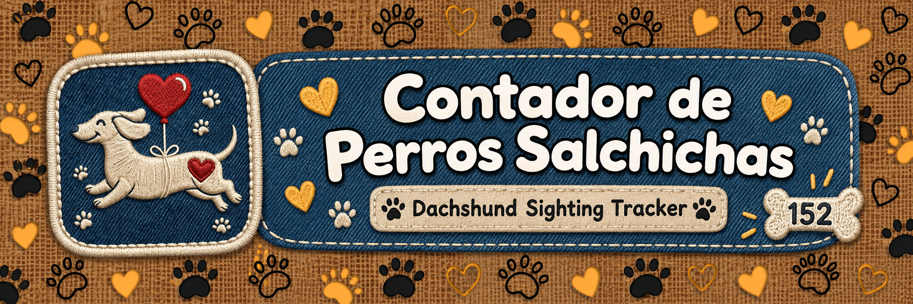
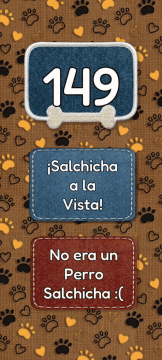
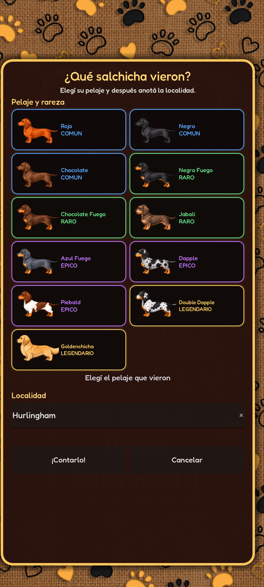
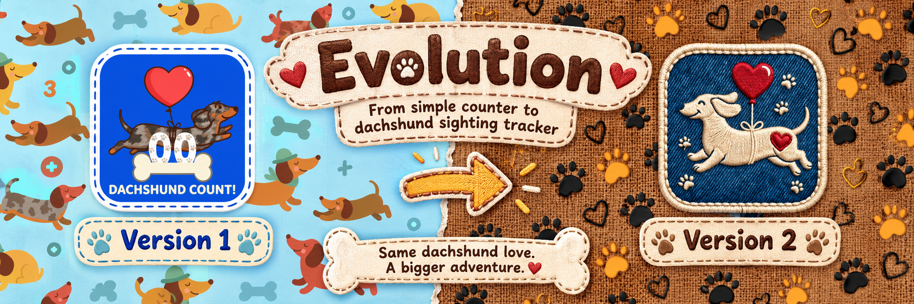
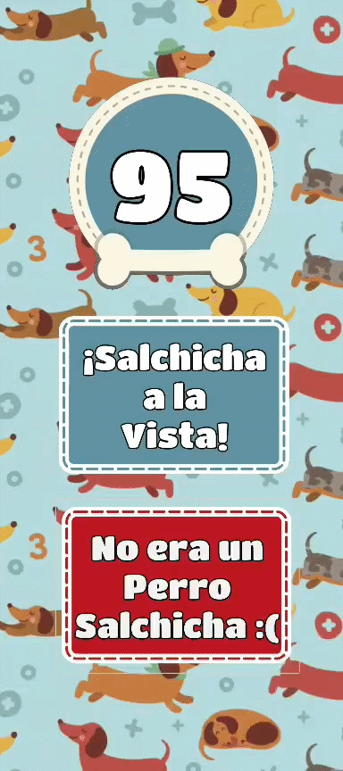
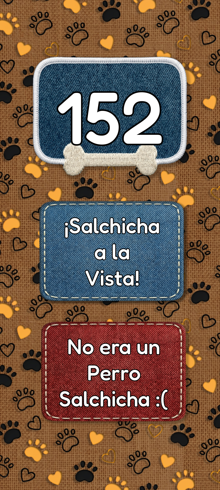

<p align="center">
  
</p>

<p align="center">
  <strong>Because there are never enough dachshunds in the world.</strong>
</p>

<p align="center">
  A small personal project that started as a simple counter and somehow evolved into a full dachshund sighting tracker.
</p>

<p align="center">
  
  
  
  
</p>

---

## What is this?

**Contador de Perros Salchichas** is a mobile app built with **Godot Engine** to keep track of every dachshund sighting.

The reason it exists is extremely serious and scientifically important:

My girlfriend and I have a tradition of counting every dachshund we see.

Naturally, remembering the number forever was not a reliable database solution.

So I made an app.

What originally started as a giant button that increased a number eventually became a cloud-synchronized sighting tracker with coat classifications, rarity levels, locations, achievements, notifications and a few secrets hidden around the app.

Software development happened.

---

## Demo

<p align="center">
  
</p>

<p align="center">
  <em>See dachshund. Identify dachshund. Count dachshund.</em>
</p>

---

## Features

### Dachshund Counter

The heart of the project is still the same:

**See a dachshund → press the button → the number goes up.**

The counter is stored locally so progress survives between sessions, while cloud synchronization keeps the shared total updated.

### Sighting Tracker

A sighting is no longer just a number.

Each dachshund can be registered with:

- Coat type
- Rarity
- Location
- Timestamp
- Platform
- Global counter value at the moment of the sighting

<p align="center">
  
</p>

### Coat Rarity System

Because apparently just counting dachshunds wasn't enough.

The app currently classifies **11 coat types** into four rarity tiers:

| Rarity | Coat types |
|---|---|
| **Common** | Rojo, Negro, Chocolate |
| **Rare** | Negro Fuego, Chocolate Fuego, Jabalí |
| **Epic** | Azul Fuego, Dapple, Piebald |
| **Legendary** | Double Dapple, **Goldenchicha** |

Yes.

**Goldenchicha is legendary.**

This is non-negotiable.

### Cloud Synchronization

The counter synchronizes through **Firebase Realtime Database**, allowing the total to stay shared instead of existing only on one device.

Individual sightings are also stored separately with their associated information.

### Milestones and Celebrations

Reaching new milestones triggers celebrations inside the app, including:

- Confetti
- Sound effects
- Animations
- Vibration
- Special messages

Because reaching another ten dachshunds deserves recognition.

### Notifications

The Android version integrates **Firebase Cloud Messaging** for push notifications.

The project also includes:

- Foreground in-app notifications
- Android system notifications
- Automatic milestone notifications
- A hidden admin interface for sending custom messages

### Hidden Features

There are also a few things in the app that are **not visible at first glance**.

Including a secret arcade.

That's all I'm saying.

If you find it, you find it.

---

## Evolution

<p align="center">
  
</p>

This project changed a lot more than I ever expected.

### Version 1 — Just count the dog

The original version was intentionally tiny.

It had:

- One counter
- One big **¡Salchicha a la Vista!** button
- One correction button
- Local persistence
- A simple mobile interface

<p align="center">
  
</p>

And thanks to the Git history, the original demo survived:

<p align="center">
  
</p>

### Version 2 — This got out of hand

The current version keeps the original idea but expands it into a proper dachshund sighting tracker.

<p align="center">
  
</p>

The UI was completely redesigned around a handmade **burlap, denim and embroidered patch** aesthetic, while the project gained cloud synchronization, detailed sightings, coat rarities, notifications, achievements and hidden features.

Same dachshund love.

Slightly more engineering.

---

## Version 1 vs Version 2

<table>
  <tr>
    <th align="center">Version 1</th>
    <th align="center">Version 2</th>
  </tr>
  <tr>
    <td align="center">
      
    </td>
    <td align="center">
      
    </td>
  </tr>
  <tr>
    <td align="center">Simple local counter</td>
    <td align="center">Cloud-connected sighting tracker</td>
  </tr>
</table>

---

## Tech Stack

| Technology | Purpose |
|---|---|
| **Godot 4** | Application engine and UI |
| **GDScript** | Main application logic |
| **Firebase Realtime Database** | Counter synchronization and sighting storage |
| **Firebase Cloud Messaging** | Push notifications |
| **GodotxFirebase** | Firebase integration for Godot |
| **Google Apps Script** | Notification backend |
| **Android Custom Build** | Native notification integration |
| **FileAccess / ConfigFile** | Local progress and preferences |

---

## Project Structure

```text
Contador-de-Perros-Salchichas/
│
├── addons/
│   └── godotx_firebase/       # Firebase plugin
│
├── android/                   # Android build configuration
├── android_custom/            # Custom Android integration
├── assets/                    # Application assets
├── Botones/                   # UI assets and fonts
│
├── docs/
│   └── media/                 # README banners, screenshots and demos
│
├── server/
│   └── appsscript/            # Notification backend
│
├── contador.gd                # Main application logic
├── contador.tscn              # Main Godot scene
├── project.godot              # Godot project configuration
│
├── .env.example               # Example configuration values
├── .gitignore
├── SECURITY.md
└── README.md
```

---

## Running the Project

### Requirements

- **Godot Engine 4.x**
- Android development environment if you want to build the mobile version
- A Firebase project for cloud features

### Setup

1. Clone the repository:

```bash
git clone https://github.com/Joaquin-Galle-ui/Contador-de-Perros-Salchichas.git
```

2. Open the project folder in **Godot 4**.

3. Use `.env.example` as a reference for the configuration values required by the project.

4. Configure your own Firebase project and notification backend if you want to use the online features.

5. Open `project.godot` and run the project.

> Private credentials and production secrets are intentionally not included in this repository.

For additional information, check [`SECURITY.md`](SECURITY.md).

---

## Technical Challenges

The first version of this project was mostly an exercise in connecting UI signals and keeping a counter alive between sessions.

The current version introduced quite a few more interesting problems:

- Synchronizing local and remote state
- Handling HTTP requests from Godot
- Persisting data locally while also using cloud storage
- Integrating Firebase with Android
- Receiving Firebase Cloud Messaging notifications
- Calling native Android functionality from GDScript
- Designing a data model for individual sightings
- Dynamically generating coat-selection UI elements
- Implementing milestone systems and animated feedback
- Keeping a mobile-first interface readable and responsive
- Hiding completely unnecessary but extremely important easter eggs

The project may have started as a joke, but it became a surprisingly useful playground for experimenting with mobile development, cloud services and Godot.

---

## Why keep the first version?

Because deleting the ugly first version and pretending the project always looked like this would be boring.

The repository history is part of the project.

Version 1 shows where the idea started.

Version 2 shows what happens when a very simple joke receives far more development time than anybody originally planned.

And honestly?

That's half the fun.

---

## About the Project

This is a **personal project**, originally created for my girlfriend and me.

We have a slightly unusual tradition:

Whenever we see a dachshund, we count it.

This app exists so we never have to ask:

> "Wait... how many salchichas were we at?"

Now there is a database for that.

Problem solved.

## Why Godot?

There was also a personal reason behind the choice of engine.

Both my girlfriend and I are from Argentina, and Godot itself was originally created in Argentina.

So when I started this project, choosing Godot felt especially fitting.

It was not only a practical choice for building a lightweight mobile app, but also a small way of using a piece of technology that came from the same country as the people this project was made for.

A very Argentine engine for a very Argentine couple counting dachshunds.

> Mate, dulce de leche, Godot, Messi, and the Dachshund Counter are all Argentine. ⭐⭐⭐  
> Coincidence? I don't think so.

It just felt right.

---

## Final Important Scientific Statement

> **Fun fact:** No dachshund was ignored during the development of this software.

Some things from the original README were too important to remove.

---

<p align="center">
  <strong>Made in Argentina with Godot, Firebase and an unreasonable commitment to counting dachshunds.</strong>
</p>